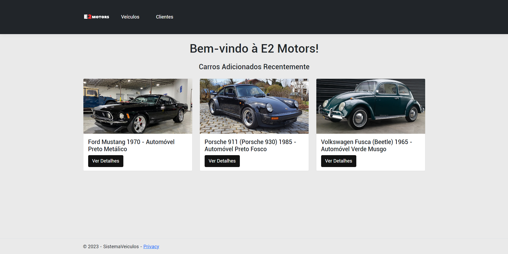
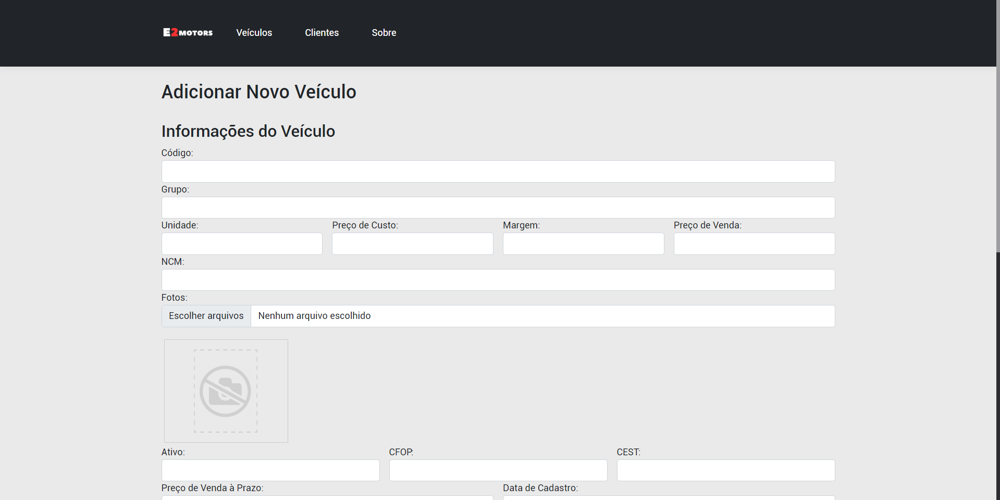

# E2Motors - Um site de Gerenciamento de Veículos.

Desenvolvimento completo de um sistema de gerenciamento de veículos, denominado E2Motors.

## Recursos Principais

Permite os seguintes recursos de gerenciamento de informações.
-Inserção
-Edição
-Exclusão
E inclui também a visualização detalhada de informações sobre os veículos, incluindo características, preços e fotos.

## Capturas de Tela

## Tecnologias Utilizadas

Neste projeto, foram utilizadas as seguintes tecnologias e bibliotecas:

- **Front-end:** HTML5, CSS3, Booststrap4, JavaScript, RazorPages.
- **Back-end:** C#, ASP.NET Core MVC, Entity Framework Core.
- **Banco de dados:** MySQL.

## Link do Deploy

Deploy feito na plataforma Azure da Microsoft, segue abaixo o link:
[Link do Site](https://e2motors.azurewebsites.net/)
